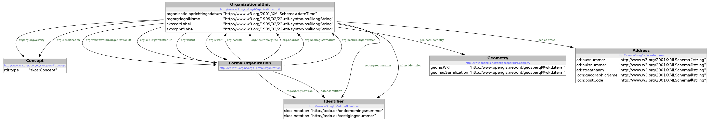

# VKBO-LOD-API
## Ondernemingen en vestigingen API - VKBO WFS van JSON naar JSON-LD en Turtle

Deze webapplicatie stelt een eenvoudige HTTP-API beschikbaar waarmee je informatie over een Vlaams perceel (op basis van CAPAKey) kunt opvragen in verschillende formaten:

- `application/json` (originele API-response)
- `application/ld+json` (verrijkte JSON-LD)
- `text/turtle` (geparsed RDF-model in Turtle)
- `application/rdf+xml` (geparsed RDF-model in rdf/xml)

---

## 🔧 Installatie

Zorg dat je Java 17+ en Maven geïnstalleerd hebt.

Clone dit project:

```bash
git clone https://github.com/gezever/CAPAKEY-LOD-API.git
cd CAPAKEY-LOD-API
```


## Build en start de applicatie:

```bash
mvn clean install
java -jar target/capakeylodapi-0.0.1-SNAPSHOT.jar
```
### of

```bash
mvn spring-boot:run
```

De applicatie draait standaard op:

### 👉 http://localhost:8080

## 🔍 Voorbeelden
### 1. Opvragen als JSON (originele Geo API-response)
```bash
   curl -H "Accept: application/json" http://localhost:8080/id/perceel/24504D0693/00B000
```   
### 2. Opvragen als JSON-LD
```bash
   curl -H "Accept: application/ld+json" http://localhost:8080/id/perceel/24504D0693/00B000
```      
   Geeft een verrijkte response terug met @context, WKT-geometrie en linked-data structuur.

### 3. Opvragen als Turtle
```bash
   curl -H "Accept: text/turtle" http://localhost:8080/id/perceel/24504D0693/00B000
```
   Geeft RDF-data terug in text/turtle formaat, bruikbaar in triple stores of RDF-tooling.

### 4. Opvragen als Rdf/Xml
```bash
   curl -H "Accept: application/rdf+xml" http://localhost:8080/id/perceel/24504D0693/00B000
```
Geeft RDF-data terug in rdf/xml formaat, bruikbaar in triple stores, RDF-tooling, of xslt-processen.

## 📦 Endpoints
| Methode | Endpoint | Beschrijving |
| :----- | :-----: | :----- |
| GET | /id/perceel/{capakey1}/{capakey2} | Perceelinformatie ophalen |

Voorbeeld:
/id/perceel/24504D0693/00B000

## 🛠 Interne werking
#### De applicatie gebruikt:

 - RestTemplate om data op te halen bij https://geo.api.vlaanderen.be

 - Jackson voor JSON-parsing

 - Apache Jena om JSON-LD naar Rdf te transformeren 

 - Apache Jena om Rdf te serialiseren naar JSON-LD, Turtle of Rdf/Xml

 - Apache Jena om Rdf te verrijken door reasoning

 - Jsonld-java om de json-ld te framen


## 📝 Licentie
MIT – Vrij te gebruiken, aanpassen of verspreiden. Link graag terug naar dit project als je het gebruikt.


## 📈 Voorgesteld Model

